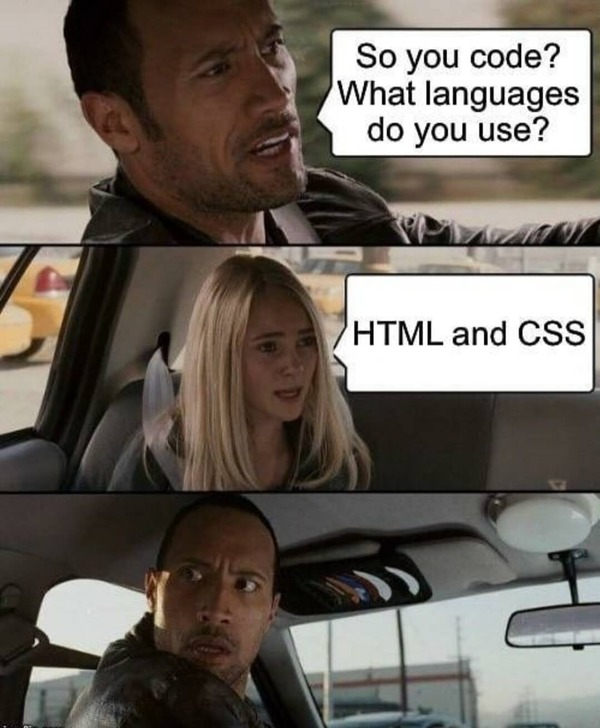

# Workshops in Web Development

A repository to store all the course content files for **'Workshops in Web Development'**. It includes files related to class notes, assignments, labs, etc.

---

## Instructors

- Adam Thomas ([Github](https://github.com/codeadamca))
- Gaurav Bhanot

---

## What We Learn

This class is all about mixing up fun with learning. The instructors create an engaging environment for the students and they carry out tasks related to 
web development. [^1]




*A programming meme taken from the movie "Journey to the center of the Earth"*


> :memo: **Note:** This class is super fun.

[^note]:
    This class takes place in the J110 room every Friday from 2:25 PM - 6:00 PM.

## Code Sample - Markdown

``` markdown
| Tables        | Are           | Cool  |
| ------------- |:-------------:| -----:|
| col 3 is      | right-aligned | $1600 |
| col 2 is      | centered      |   $12 |
| zebra stripes | are neat      |    $1 |
```

- Github
- Markdown
- Github in groups
- A set hackathon
- Document conversion
- Deployment 

[^1]: We have learned the topics above by now:
